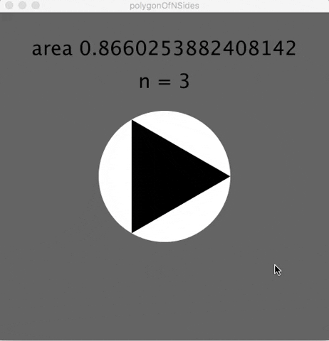

# polygonOfNSides

Displays a regular polygon of n sides. N starts as 3 but increases with every click. As N approches infinity, the area will approcach PI and the polygon 
will approach a circle. 

